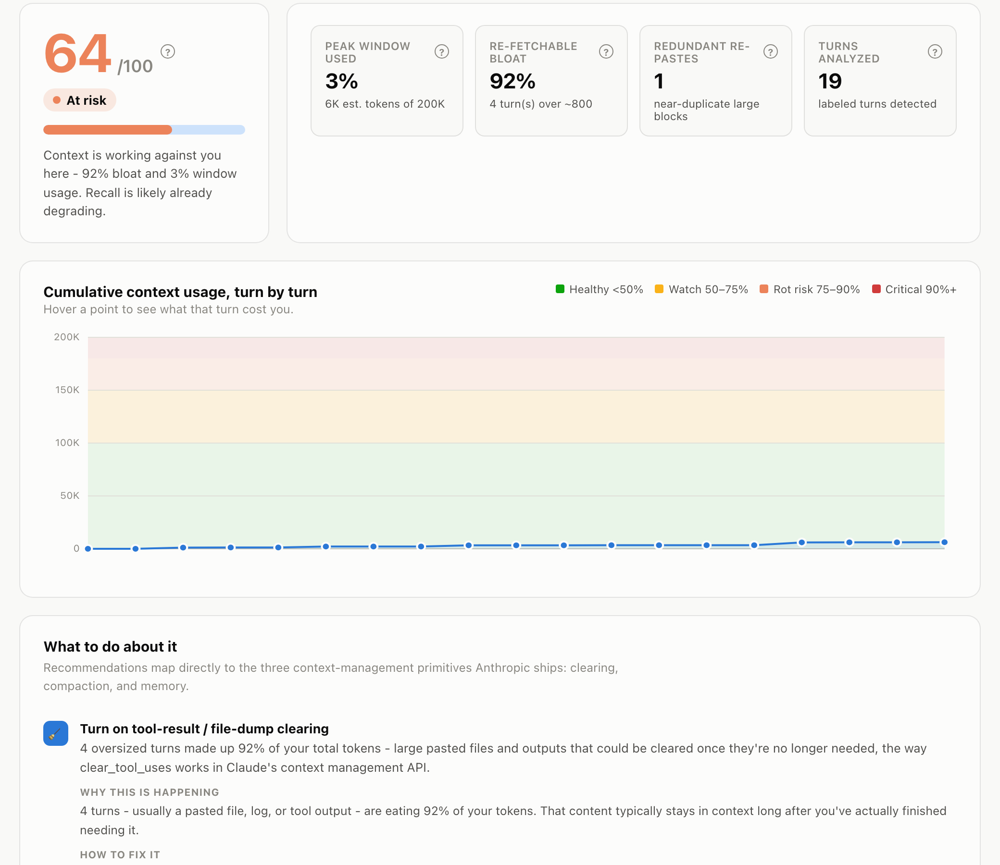

# Context Health Check

Diagnoses "context rot" in AI chat sessions in real time - a live health score, not just a token counter.

**[Try it live](https://shreyakulkarni-projects.github.io/context-health-check/)** - paste a conversation, get a score, no install. Nothing you paste leaves your browser.



## The problem

**Context rot** is the documented phenomenon where an LLM's ability to recall and use information degrades as a conversation grows - well before it hits the hard token limit. The context window doesn't overflow; the model just gets quietly worse at using what's still technically "in there." Nothing errors out. Nothing warns you. The output just gets a little less reliable, one turn at a time, until it's noticeably wrong and nobody can point to the exact moment it started.

**Who runs into this:** anyone in an extended AI conversation, but it bites hardest for the people who spend the most time in one:

- **Developers** in long AI-assisted coding sessions - pasting files, reading tool output, debugging across dozens of turns in a single chat.
- **Autonomous coding agents** (Claude Code and similar) that run for hours across hundreds of tool calls, where context accumulates from file reads and command output, not just a human typing more.
- **Researchers and analysts** running multi-turn investigations that build on earlier findings turn after turn.
- **Support and ops teams** working long incident or customer threads where early details still matter late in the conversation.

**The impact, concretely:**

- **Wasted cost.** Every turn re-processes the *entire* prior context. A file pasted twice, or a stale tool result nobody cleared, gets paid for again on every single subsequent turn, not just once.
- **Silently wrong answers.** This is the dangerous one: the model doesn't refuse or error when context rot sets in. It answers confidently, using information it's technically already been given, just less reliably. The user has no signal until the output is visibly off - or wrong in a way that's already been acted on.
- **Repeated work.** A user re-explains context they already gave because the model's use of it has degraded, even though it's still sitting in the transcript.
- **Compounding failure in agents.** For autonomous, long-running agents, there's no human in the loop to notice the conversation "feels off." The agent just keeps making decisions on progressively worse recall, and each decision compounds into the next.

## The research

- **[Chroma's 2025 "Context Rot" study](https://www.trychroma.com/research/context-rot)** (Kelly Hong, Anton Troynikov, Jeff Huber) tested 18 frontier models - Claude Opus 4, Sonnet 4, Sonnet 3.7, Sonnet 3.5, Haiku 3.5; OpenAI o3, GPT-4.1 (and mini/nano), GPT-4o, GPT-4 Turbo, GPT-3.5 Turbo; Gemini 2.5 Pro/Flash, 2.0 Flash; and Qwen3-235B/32B/8B - and found performance is *non-uniform* and degrades as input length grows, even on simple tasks like retrieval or exact text replication. Bigger context windows do not mean proportionally better results.
- **["Lost in the Middle"](https://arxiv.org/abs/2307.03172)** (Liu et al., Stanford/TACL 2023) found a U-shaped recall curve: models perform best when the relevant information sits at the very start or very end of the context, and reliably worse when it's buried in the middle - a pattern that held even for models built specifically for long context.
- **[Anthropic's own Claude Cookbook](https://platform.claude.com/cookbook/tool-use-context-engineering-context-engineering-tools)** prescribes three concrete mitigations for exactly this problem: **tool-result clearing**, **compaction**, and **memory**. What it stops short of is telling you *when* a given conversation actually needs one of them, versus when it's still fine. Context Health Check is that missing diagnosis layer: a score, a reason for the score, and a recommendation that maps straight back to one of these three primitives.

## Quickstart

### Chrome extension (live side panel)

```bash
git clone https://github.com/<your-username>/context-health-check.git
cd context-health-check
npm install
npm run build -w @context-health/extension
```

Then in Chrome:
1. Go to `chrome://extensions`, enable **Developer mode** (top right).
2. Click **Load unpacked**, select `packages/extension/dist`.
3. Open a conversation on [claude.ai](https://claude.ai) or [chatgpt.com](https://chatgpt.com) and click the extension icon to open the side panel.

The panel re-scores live as the conversation grows. If it can't detect the page's messages (site layout changed, or you're somewhere it doesn't recognize), it falls back to a paste box automatically instead of showing a blank panel.

### MCP server (self-diagnose a Claude session)

```bash
npm run build -w @context-health/mcp-server
```

Add to your Claude Desktop or Claude Code MCP config:

```json
{
  "mcpServers": {
    "context-health": {
      "command": "node",
      "args": ["/absolute/path/to/context-health-check/packages/mcp-server/dist/index.js"]
    }
  }
}
```

Full details, including the `npx`-ready config for once this is published, are in [`packages/mcp-server/README.md`](packages/mcp-server/README.md).

### Web demo (zero install)

**[Use it live](https://shreyakulkarni-projects.github.io/context-health-check/)**, or build and run it yourself:

```bash
npm run build -w @context-health/web-demo
open packages/web-demo/dist/index.html
```

One static HTML file, no server, no build step for the person opening it. This is what's pictured above.

## Architecture

Three front doors, one scoring engine - the algorithm exists in exactly one place, and everything else imports it.

```
┌─────────────────────┐   ┌─────────────────────┐   ┌─────────────────────┐
│  packages/extension   │   │  packages/mcp-server │   │  packages/web-demo   │
│  Chrome MV3 side panel│   │  local stdio server  │   │  single HTML file     │
│  reads the live DOM   │   │  3 tools for Claude   │   │  paste-box, one-shot │
└──────────┬───────────┘   └──────────┬───────────┘   └──────────┬───────────┘
           │                          │                          │
           └──────────────┬───────────┴──────────────┬───────────┘
                           │                          │
                           ▼                          ▼
                  ┌──────────────────────────────────────┐
                  │            packages/core              │
                  │  pure TypeScript, zero DOM/network deps│
                  │  token estimation · bloat detection    │
                  │  redundancy detection · scoring         │
                  │  recommendations · ConversationAnalyzer │
                  └──────────────────────────────────────┘
```

- **`packages/core`** parses `{ speaker, text, timestamp? }` turns, estimates tokens, flags bloated and redundant turns, computes a 0-100 score with a risk zone, and generates prioritized recommendations. It never touches a DOM or parses a raw pasted string - every caller normalizes into typed turns first.
- **`packages/extension`** reads the conversation straight off the page via a `MutationObserver` and per-site adapter, re-scoring incrementally as new turns arrive.
- **`packages/mcp-server`** exposes the same engine as three MCP tools so Claude Desktop/Code can score their own session.
- **`packages/web-demo`** is the original single-file HTML prototype, now importing its scoring logic from `core` instead of carrying its own copy.

See [`SHOWCASE.md`](SHOWCASE.md) for the engineering tradeoffs behind these choices, and [`packages/mcp-server/REMOTE.md`](packages/mcp-server/REMOTE.md) for the planned remote/OAuth path.

## Testing and evals

Two different layers, testing two different things:

```bash
npm test                       # core's Vitest suite - unit-level correctness
npm run eval -w @context-health/core   # evals - realistic conversations, business-level outcomes
```

The **unit tests** check that individual functions are correct in isolation: does `computeScore` land on the right number at each grade boundary, does the redundancy detector correctly ignore two different large pastes.

The **evals** (in [`packages/core/evals`](packages/core/evals)) check something unit tests can't: given a *realistic conversation shape* - a file paste, an accidental re-send, a long back-and-forth, a near-full window - does the engine's overall judgment make sense end-to-end. Each case asserts an outcome (a score range, a risk zone, which recommendations should or shouldn't fire), not an internal value. This is also the harness that caught a real miscalibration in its own test data while it was being built - see [`packages/core/evals/README.md`](packages/core/evals/README.md) for that story and how to add a case. Both suites are gated in CI.

## Development

```bash
npm install
npm test              # core's Vitest suite
npm run typecheck      # all packages
npm run build          # all packages
```

## Resources

**Research this project is built on:**
- Hong, Troynikov, Huber. ["Context Rot: How Increasing Input Tokens Impacts LLM Performance."](https://www.trychroma.com/research/context-rot) Chroma Research, 2025.
- Liu, Lin, Hewitt, Paranjape, Bevilacqua, Petroni, Liang. ["Lost in the Middle: How Language Models Use Long Contexts."](https://arxiv.org/abs/2307.03172) arXiv:2307.03172, 2023.
- Anthropic. ["Context engineering: memory, compaction, and tool clearing."](https://platform.claude.com/cookbook/tool-use-context-engineering-context-engineering-tools) Claude Cookbook.
- Anthropic. ["Context editing"](https://platform.claude.com/docs/en/build-with-claude/context-editing) and the [memory tool](https://platform.claude.com/docs/en/agents-and-tools/tool-use/memory-tool). Claude Platform Docs.

**APIs and platforms this project builds on:**
- [Model Context Protocol](https://modelcontextprotocol.io) - the spec `packages/mcp-server` implements.
- [`chrome.sidePanel`](https://developer.chrome.com/docs/extensions/reference/api/sidePanel) - the Chrome MV3 API `packages/extension` is built around.

## License

MIT - see [LICENSE](LICENSE).
